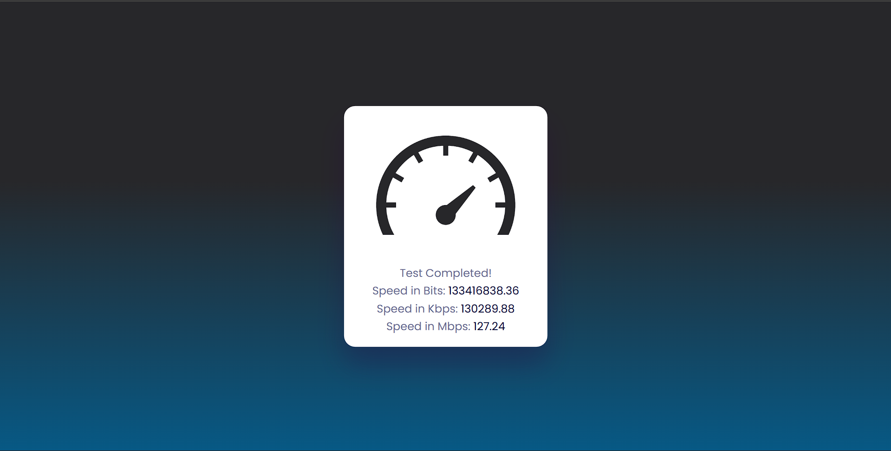

# 🚀 NetPulse - Internet Speed Detector

NetPulse is a simple web application that measures your internet download speed using JavaScript. It performs multiple download tests, calculates the average speed, and displays the results in:

- Bits per second (bps)
- Kilobits per second (Kbps)
- Megabits per second (Mbps)

---

## 📸 Preview



---

## ✨ Features

- Real-time internet speed testing
- Multiple test runs for better accuracy
- Average speed calculation
- Clean and responsive UI
- Pure HTML, CSS, and JavaScript
- No external frameworks required

---

## 🛠️ Technologies Used

- HTML5
- CSS3
- JavaScript (ES6)
- Fetch API

---

## 📂 Project Structure

```bash
NETPULSE/
│
├── screenshots/
│   └── NetPulse-Working.png
│
├── speedometer.png
├── index.html
├── style.css
├── app.js
└── README.md
```

---

## ⚙️ How It Works

1. The application downloads a test file from Cloudflare's speed testing server.
2. The download start and end times are recorded.
3. Download speed is calculated using:

```text
Speed = File Size (bits) / Download Time (seconds)
```

4. The test is repeated 3 times.
5. The average speed is displayed in bps, Kbps, and Mbps.

---

## 🚀 Installation & Usage

### Clone the Repository

```bash
git clone https://github.com/utkarsh1-a11y/net-pulse.git
```

### Navigate to the Project Folder

```bash
cd NetPulse
```

### Run the Project

Simply open:

```bash
index.html
```

in your browser.

Or use VS Code Live Server:

```bash
Right Click → Open with Live Server
```

---

## 📊 Speed Calculation Formula

```text
Bits per Second (bps) = File Size (Bytes × 8) / Time Taken

Kilobits per Second (Kbps) = bps / 1024

Megabits per Second (Mbps) = Kbps / 1024
```

---

## 🔧 Future Improvements

- Upload speed testing
- Ping and latency measurement
- Download speed graph visualization
- Dark/Light mode support
- Speed history tracking
- Progressive Web App (PWA)

---

## 📜 License

This project is open-source and available for learning and educational purposes.

---
